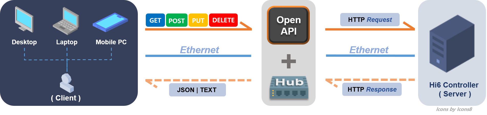

## 0.1 关于 ${cont_model} 开放 API

在本文件中，HD 现代机器人发布了一个 API，供应用开发人员轻松监控和远程控制机器人控制器（以下简称 ${cont_model}）。 
这使得开发人员能够读取和写入 ${cont_model} 数据，而无需深入理解用于 ${cont_model} 开发的源代码。 
下面的图像将帮助您更好地理解开放 API 的角色。

上图中标记为橙色的部分显示了开放 API 的角色。

|箭头标志|描述|
|:---|:---|
|`实线`|这意味着 `开发者` (`客户端`) 使用四种方法中的一种（GET、POST、PUT、DELETE）向 `${cont_model}` (`服务器`) `请求` 信息。|
|`虚线`|这意味着 `接收` `请求` 的 `控制器` `发送回` 适当的 `响应`，格式为 json 或文本。|

通过这种方式，开发人员可以使用文档中的开放 API 远程控制或监控通过 ${cont_model} 和基于 http 和 REST API 的以太网连接的台式机、笔记本电脑、平板电脑等。

  

#### 在开始之前请务必检查！

* 当前文档是基于 ${cont_model} 开放 API 架构版本 `5` 编写的。您可以通过 [API](../../2-version/1-get/1-api_ver.md) 查看。

* 对于熟悉开发 HTTP REST API 客户端功能的开发人员，您可以跳过 [0.2 先决知识](../2-prerequisite/README.md) 到 [0.4 无需编码的简单 API 调用](../4-api-test/README.md)。



除非另有说明，本文件中描述的 API 从 `${cont_model} V60.24-00` 开始支持。

请注意，本文件中未指定的 URL 和属性可能会在相同 API 版本中不经通知而更改。

