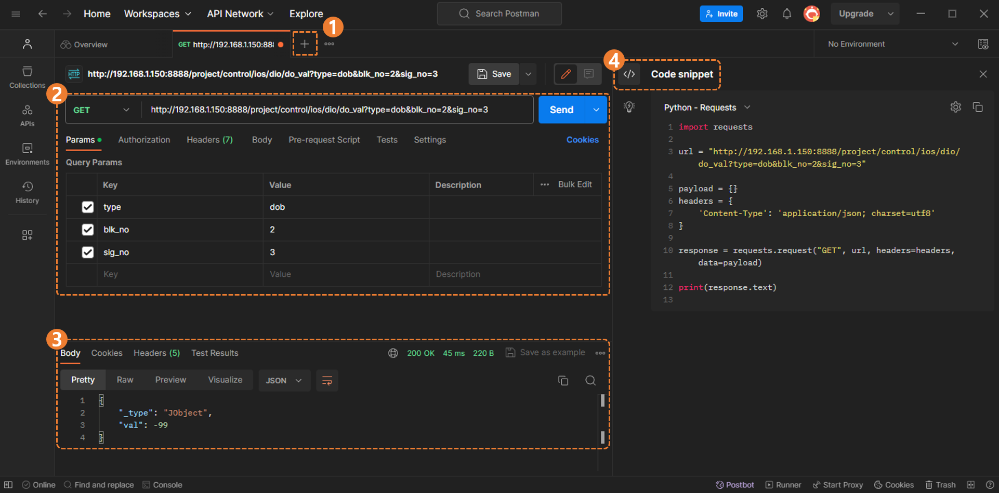
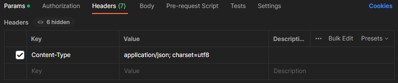
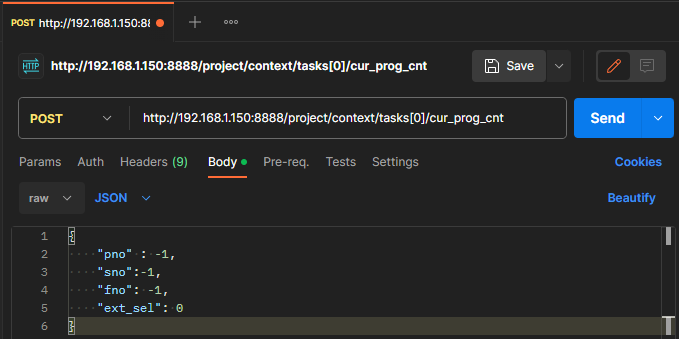
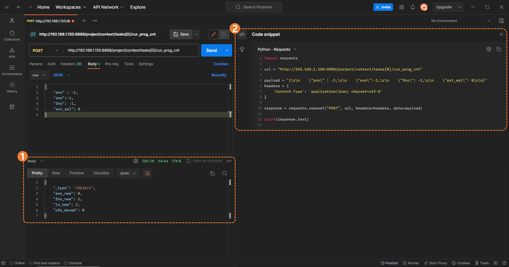

#### 0.4.1 在 Postman 中请求 POST

在此页面上，使用 `postman` 调用 REST API 的 `POST` 请求并检查结果。  
此外，简单的 UI 配置帮助您了解如何使用它。

 

##### a. 主要 UI 组成

您可以通过下图查看主要 UI 组成。

<blockquote>

(1) 您可以通过 ` (+)` 按钮简单地创建一个请求。  
(2) 这是输入 `request` 信息的空间。  
(3) 这是检查 `response` 信息的空间。  
(4) 这是一个检查通过应用 `request` URL 自动生成的每种语言的 `Code snippet` 的空间。  

</blockquote>

 

##### b. 测试 POST 请求

1. `Request Header`  
	- 在 Headers 标签下输入 `Key` 和 `力控制变量 (Value)`。  
	- 关于 `Content-Type` ([ref](https://blog.postman.com/what-are-http-headers/#Content-type))
	 

 

2. `Request Body`  
	- 将 API 方法选择为 `POST` 并输入 URL。  
	- 点击 `Body` 标签并输入您想请求的 `body-parameter`。 ([9.2.1 `task/cur_prog_cnt` - request body](../../9-task/2-post/1-cur_prog_cnt.md))
	- 点击 `Send`  
		

 

3. `Response` 和 `Code snippet`
	- 如果请求正常完成，`request` 的 `HTTP Status` 将响应 `200 OK`，如下所示。([HTTP Status](https://developer.mozilla.org/zh-US/docs/Web/HTTP/Status))
	- 您也可以检查应用于 URL 的每种语言的 `Code snippet`。  
		  
		<blockquote>

		`(1) Response body` : `post` 请求的响应 ([9.2.1 `task/cur_prog_cnt` - response body](../../9-task/2-post/1-cur_prog_cnt.md)) 
		`(2) Python Code snippet` : `post` 请求的 Python 代码。  

		</blockquote>