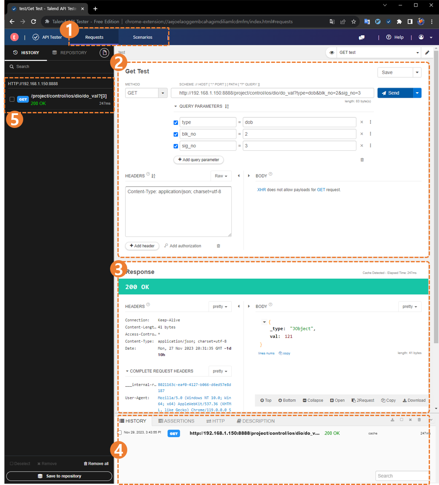

#### 0.4.2 从网络浏览器调用 API  

###### a. 发出简单的 `GET` 请求

`get` 请求可以通过网络浏览器更简单和快速地检查。步骤如下：
1. 打开网络浏览器
2. 在地址栏中输入 `get` 请求的服务器端 URL。
	- 服务器端 URL 以 `http://<IP 地址 ${cont_model} 控制器>:<http 通信端口>` 开头，后面跟着您要提取的信息的路径和查询。
	- 例如) ```http://192.168.1.150:8888/project/control/ios/dio/do_val?type=dob&blk_no=2&sig_no=3```
3. 该 URL 的页面打开并输出响应，如下所示。
	```json
	{
		"_type" : "JObject",
		"val" : -99
	}
	```

<br>

###### b. 使用 `extension` 调用 API
如果您使用 Chrome 或 Edge 浏览器，可以通过 Chrome 扩展程序测试除 `get` 请求以外的 API。  
以下扩展程序是许多开发人员在全球使用的 API 测试工具。
- Chrome 扩展程序 : [Talend API Tester](https://chromewebstore.google.com/detail/talend-api-tester-free-ed/aejoelaoggembcahagimdiliamlcdmfm)  

通过这个程序，您可以像 `postman` 一样轻松调用各种 API。



<blockquote>

`(1) 请求/场景` : 您可以设置是测试对单个 API 的调用，还是创建多个 API 的场景并依次进行测试。<br>
`(2) 请求` : 输入您的请求。  
`(3) 响应` : 您可以检查对您请求的响应。  
`(4) 历史` : 打印请求历史。   
`(5) 侧边历史标签` : 此标签允许您检查比 `(4)` 中的请求历史列表更多的历史，可以打开和关闭。

</blockquote>