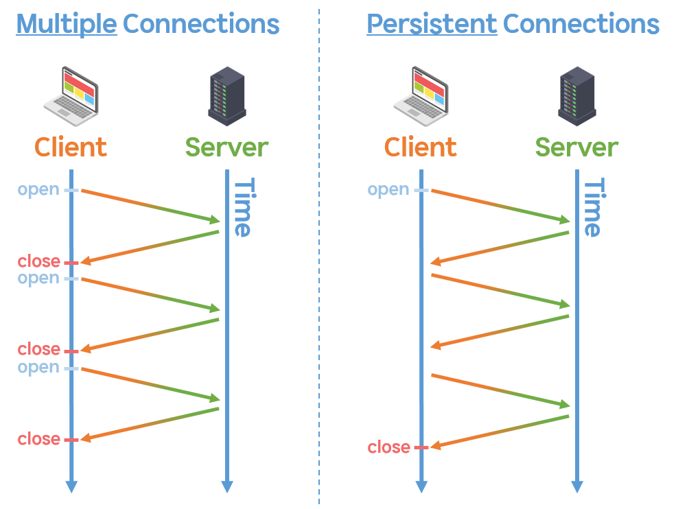
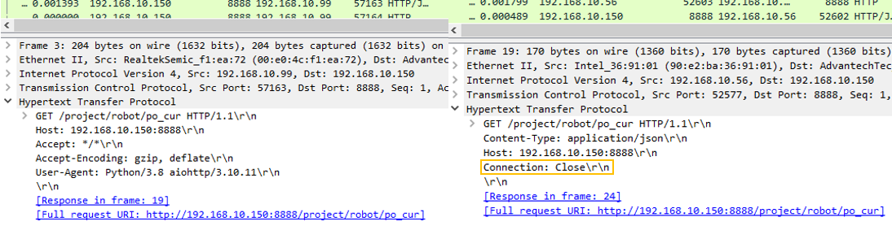

#### 0.5.1. Keep-Alive vs Close connection



For robot controllers, repeated API requests using the `close` connection type may lead to high CPU load, potentially causing the robot to halt unexpectedly.

If your application involves frequent API calls, please follow the instructions below and implement them using the **Keep-Alive** connection method.



<br>

###### 1-1. Comparing Two HTTP Connection Methods

<div style="max-width: fit-content">

| | Close | Keep-Alive |
|--| ----- | ----- |
|Recommended HTTP Version| HTTP/1.0 | HTTP/1.1 |
|Characteristics| Multiple Connections | Persistent Connection |



</div>

- The `close` connection type establishes and terminates a connection for every single request and response.<br>
  This process results in increased latency and resource usage, placing a heavy burden on both the server and the client.

- ${cont_model} uses HTTP/1.1, which defaults to Keep-Alive connections unless explicitly overridden.

- Please refer to the sample code below and make sure that frequently called APIs are implemented using Keep-Alive, not the close method.

<br>

###### 1-2. Example Code

- Switching between `close` and `keep-alive` connections is simple and can be done by modifying the request headers.

- Close connection
  <div style="max-width:fit-content">

	```python
	import requests
	import time

	BASE_URL = "http://192.168.10.150:8888"
	URI = "/project/robot/po_cur"
	URL = BASE_URL + URI
	headers = { "Connection": "close" }

	response = requests.get(URL, headers=headers)
	```
	</div>
- Keep-Alive
  <div style="max-width:fit-content">

	```python
	import requests
	import time

	BASE_URL = "http://192.168.10.150:8888"
	URI = "/project/robot/po_cur"
	URL = BASE_URL + URI

	# default connection is Keep-alive
	response = requests.get(URL)
	```
	</div>
- Packet Capture Comparison - Connection Header info <br>
	<br>
	Left) Keep-Alive, Right) Close

<br><br>

References
  1) [HTTP/1.1 persistent connection](https://datatracker.ietf.org/doc/html/rfc2616#section-8)
