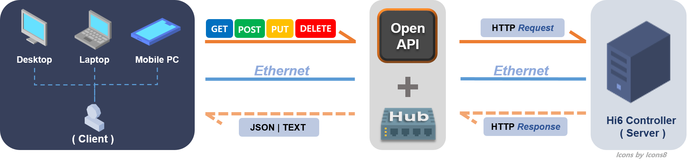

## 1.1 Overview

### 1.1.1 About Hi6 Open API

In this document, HD Hyundai Robotics publishes an API for application developers to easily monitor and remotely control the robot controller (hereafter referred to as Hi6). 
This enables developers to read and write Hi6 data without requiring a thorough comprehension of the source code used in Hi6 development. 
The image below will help you better grasp the role of Open API.

The parts marked in orange in the picture above show the role of Open API.

|Arrow sign|Description|
|:---|:---|
|`Solid line`|This means that the `developer` (`client`) `requests` information to `Hi6` (`server`) using one of four methods (GET, POST, PUT, DELETE).|
|`Dotted line`|This means that the `controller` that `received` the `request` `sends back` the appropriate `response` in json or text format.|

In this way, developers can use the Open API in the document to remotely control or monitor their desktops, laptops, tablet PCs, etc. connected via Hi6 and Ethernet based on http and REST API.

 

### 1.1.2 Be sure to check before you start!

* The current document is an initial version and was written based on Hi6 Open API version 5.

* There may be continuous version updates in the future. If the version is updated, please refer to the corresponding section.

* For developers who are familiar with developing HTTP REST API client functions, you can skip from `1.2 Required prior knowledge` to `1.6 Calling API from a web browser`.

 



The APIs described in this document are supported starting from `Hi6 V60.24-00` unless otherwise specified.

Please note that URLs and properties not specified in this document may change without notice in the same API version.

