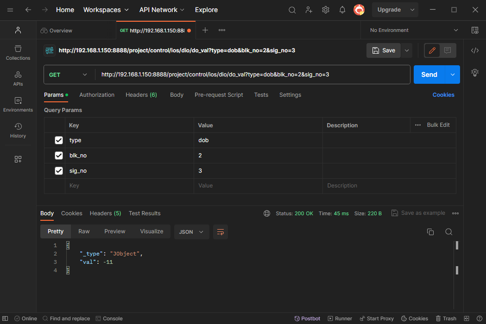
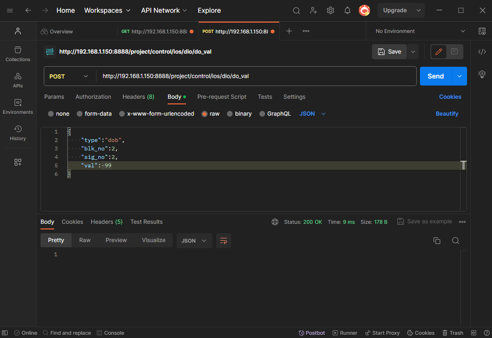
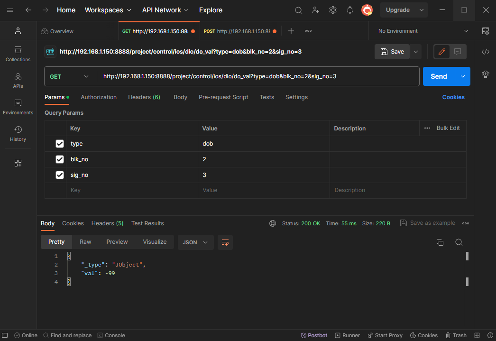

# 1.3 REST API 테스트

REST API 테스트를 하는 방법은 여러가지가 있습니다. 해당 섹션에서는 다양한 방법 중 대표적인 방법에 대해서 살펴보겠습니다.

1.3.1 `postman` 프로그램 활용하기<br>
1.3.2 웹 브라우저 활용하기

<br>

## 1.3.1 `postman` 프로그램 활용하기
- `postman` 은 세계적으로 많이 사용되는 API 테스팅 플랫폼 입니다.
- `workspace` 기능을 통해 프로젝트 단위의 API 테스트와 history 추적이 가능하며, 직관적으로 response 값을 보여줍니다.
- 사용법
	1. [프로그램 설치](https://www.postman.com/downloads/)와 회원가입을 진행합니다.
	2. 프로그램을 실행하고 로그인을 진행합니다.
	3. home 화면에서 `Overview` 옆의 `+` 버튼을 통해 테스트 하려는 API 탭을 생성합니다.
		- `get` 요청
			- 요청 대상 서버 url 을 입력하고, 필요한 데이터에 맞는 쿼리 파라미터를 작성하고 `send`를 클릭합니다.
			- `send` 가 정상적으로 처리되면 `그림1`처럼 `200 OK`라는 Status 값과 `Body` 값을 확인할 수 있습니다. 
				<details><summary>그림1</summary>
		- `post` 요청
			- 3.의 `+`을 통해 `post` 요청을 위한 탭을 생성합니다
			- `get` 옆의 `아래 화살표 버튼`을 클릭하여 `post` 요청으로 변경합니다.
			- 로봇 제어기에 `json` 형태의 값을 전달하는 경우 하기 순서대로 진행합니다. <br>
				`Body 클릭 -> raw 클릭 -> text 클릭 -> json 클릭` 
			- `json` 으로 변경된 `Body` 칸에 전달하려는 값을 하기처럼 입력 후 `send`를 클릭합니다.
				```json
					{
						"type":"dob",
						"blk_no":2,
						"sig_no":2,
						"val":-99
					}
				```
			- `send` 가 정상적으로 처리되면 `그림2`처럼 `200 OK`라는 Status 값을 확인할 수 있습니다. 
				<details><summary>그림2</summary>
			- `post` 가 정상적으로 처리 되었는지 확인하기 위해 `그림3`처럼 `get` 요청을 통해 값 변경 여부를 확인합니다.
				<details><summary>그림3</summary>


<br>


## 1.3.2 웹 브라우저 활용하기
- `get` 요청에 대한 결과를 간편하고 신속하게 확인하는 방법입니다.
- 순서는 다음과 같습니다.
	1. 웹 브라우저 엽니다.
	2. 주소 창에 `get` 요청의 서버 측 url 을 입력합니다.
		- 서버 측 url 은 `http://<Hi6 제어기의 ip 주소>:<http 통신 포트>`로 시작되며 추출하려는 정보에 맞는 경로와 쿼리를 이어 적습니다.
		- ex) ```http://192.168.1.150:8888/project/control/ios/dio/do_val?type=dob&blk_no=2&sig_no=3```
	3. 해당 url 의 페이지가 열리고 아래와 같이 response 값이 출력됩니다.
		```json
		{
			"_type" : "JObject",
			"val" : -122
		}
		```
- 크롬 브라우저를 사용하는 경우, 크롬 확장 프로그램을 통해 `get` 요청 이외의 api 들을 테스트할 수 있습니다.
	- 크롬 확장 프로그램 : [Talend API Tester](https://chromewebstore.google.com/detail/talend-api-tester-free-ed/aejoelaoggembcahagimdiliamlcdmfm)
	- 사용법은 앞서 언급한 `postman` 사용법과 비슷합니다.
