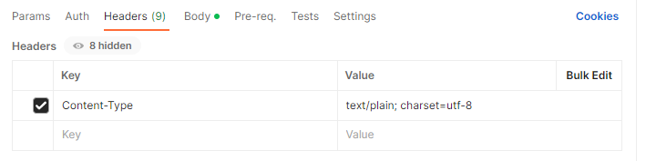
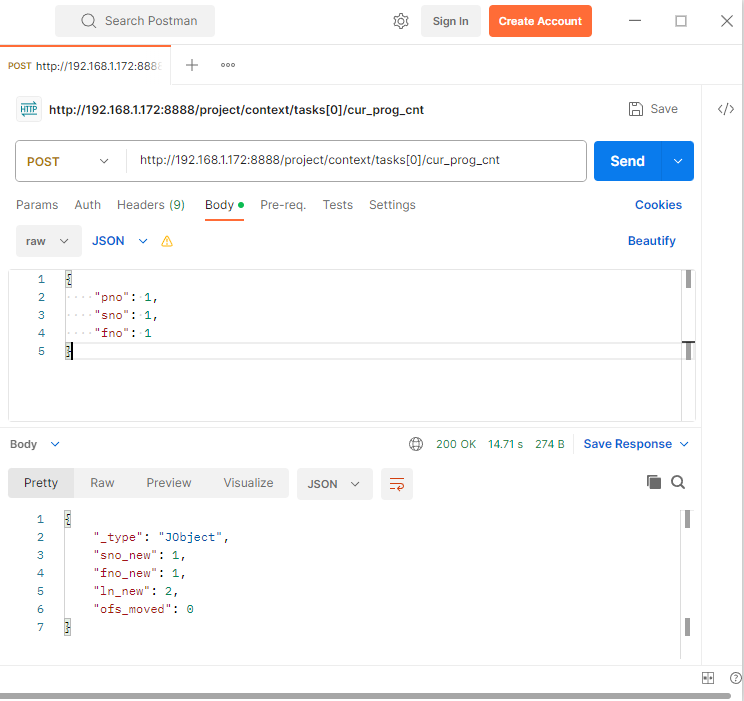

# 1.4 Postman을 활용한 POST 시험

Postman으로 POST 요청을 시험할 수 있습니다.

- Headers 탭에 아래의 Key-Value를 입력합니다.  
  - Key=Content-Type, Value=text/plain; charset=utf-8

- 아래 그림과 같이 POST method를 선택하고 URL을 입력합니다.
- Body 탭에는 body-parameter를 입력합니다.
- Send를 클릭합니다.

