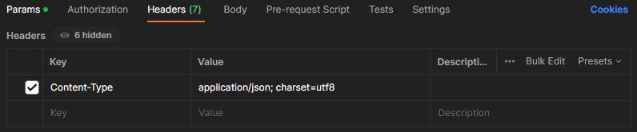
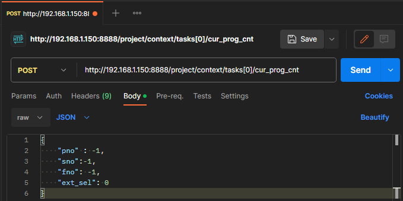

# 1.4 Postman을 활용한 POST 시험

Postman으로 POST 요청을 시험할 수 있습니다.

1. `Request Header` 작성 
	- Headers 탭에 아래의 Key-Value를 입력합니다.
  	- Content-Type 참조 링크 - [postman](https://blog.postman.com/what-are-http-headers/#Content-type)
	 
	

 

2. `Request Body` 작성 
	- API method 를 `POST` 로 선택하고 URL을 입력합니다.
	- Body 탭 클릭 후 요청하려는 `body-parameter`를 입력합니다.
	- Send를 클릭합니다.
	 
	

 

3. `Response` 확인 및 `Code Snippet` 참조
	- `request` 요청이 정상적으로 완료되면 아래 그림의 (1)과 같이 `HTTP Status` 가 `200 OK`로 응답합니다.
	- [HTTP Status 참조](https://developer.mozilla.org/en-US/docs/Web/HTTP/Status)
	- 해당 url 이 적용된 언어별 `Code snippet` 을 확인하고 싶으시면 (2)의 `</>` 버튼을 클릭하면 됩니다.
	