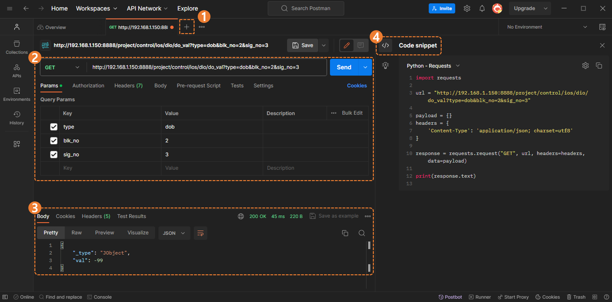
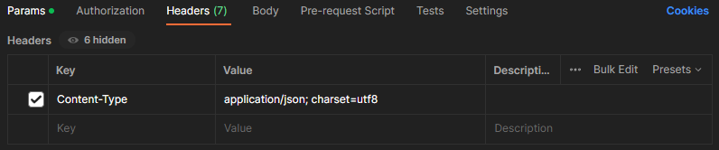
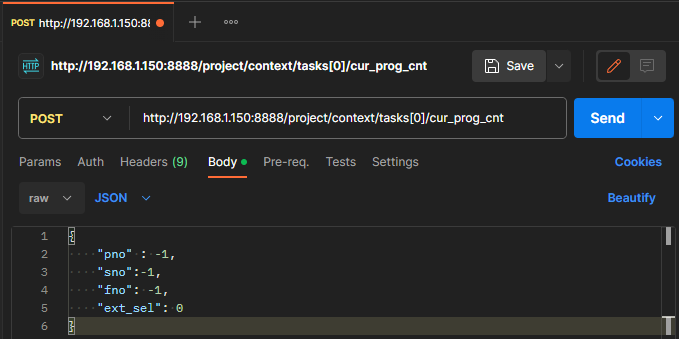
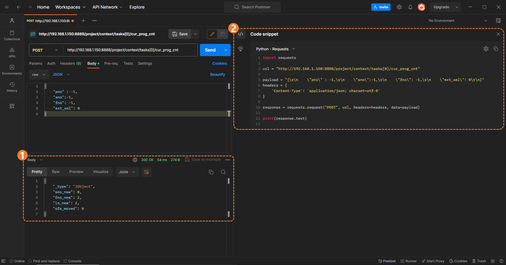

## 1.5 `Postman` 에서 `POST` 요청하기

해당 페이지에서는 `postman` 을 활용해서 REST API 의 `POST` 요청을 호출하고 결과를 확인합니다.  
추가로 간단한 UI 구성을 통해 사용법을 파악합니다.

 

### 1.5.1. 주요 UI 구성

아래 그림을 통해 주요 UI 구성을 확인할 수 있습니다.  

<blockquote>

(1) `+` 버튼을 통해 request 요청을 간단하게 생성할 수 있습니다.  
(2) `request` 요청에 대한 정보들을 입력하는 공간 입니다.  
(3) `response` 에 대한 정보들을 확인하는 공간입니다.  
(4) `request` url 이 적용되어 자동으로 생성된 언어별 `Code snippet`을 확인하는 공간입니다.  

</blockquote>

 

### 1.5.2. POST 요청 시험하기

1. `Request Header` 작성 
	- Headers 탭에 아래의 Key-Value를 입력합니다.
  	- Content-Type 관련 ([postman](https://blog.postman.com/what-are-http-headers/#Content-type) 참조)
	 

 

2. `Request Body` 작성 
	- API method 를 `POST` 로 선택하고 URL을 입력합니다.
	- Body 탭 클릭 후 요청하려는 `body-parameter`를 입력합니다. ([9.2.1 `task/cur_prog_cnt` - request body](../../9-task/2-post/1-cur_prog_cnt.md) 참조)
	- Send를 클릭합니다.  
		

 

3. `Response` 확인 및 `Code snippet` 참조
	- `request` 요청이 정상적으로 완료되면 아래 그림과 같이 `HTTP Status` 가 `200 OK`로 응답합니다. ([HTTP Status](https://developer.mozilla.org/en-US/docs/Web/HTTP/Status) 참조)
	- 해당 url 이 적용된 언어별 `Code snippet` 또한 확인 가능합니다.  
		
		<blockquote>

		`(1) Response body` : `post` 에 대한 응답 결과 ([9.2.1 `task/cur_prog_cnt` - response body](../../9-task/2-post/1-cur_prog_cnt.md) 참조) 
		`(2) Request` 에 대한 python `Code snippet`

		</blockquote>