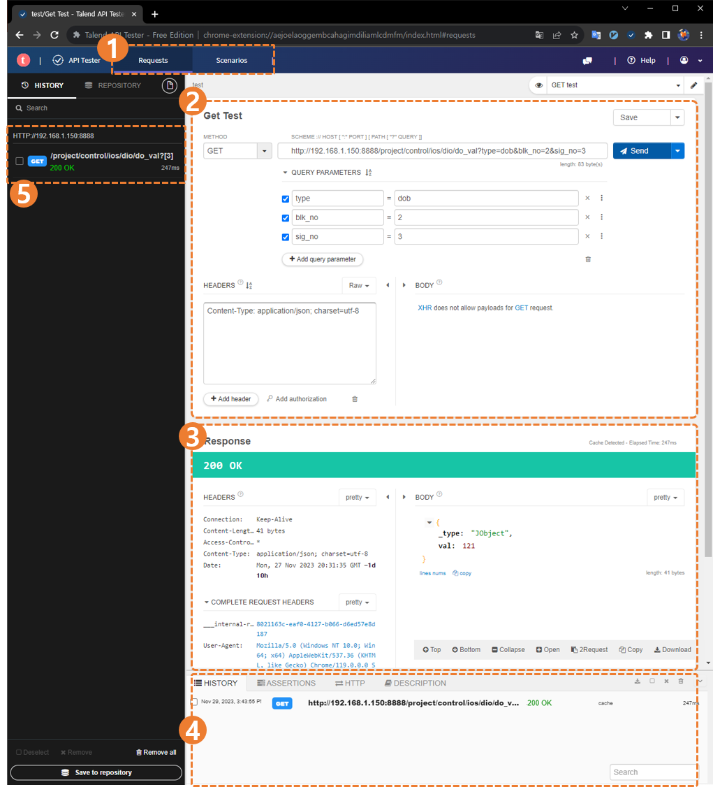

## 1.6 웹 브라우저에서 API 호출하기

### 1.6.1. 간단한 `GET` 요청하기

`get` 요청은 웹 브라우저를 통해 보다 간편하고 신속하게 확인할 수 있습니다. 순서는 다음과 같습니다.
1. 웹 브라우저 엽니다.
2. 주소 창에 `get` 요청의 서버 측 url 을 입력합니다.
	- 서버 측 url 은 `http://<Hi6 제어기의 ip 주소>:<http 통신 포트>`로 시작되며 추출하려는 정보에 맞는 경로와 쿼리를 이어 적습니다.
	- ex) ```http://192.168.1.150:8888/project/control/ios/dio/do_val?type=dob&blk_no=2&sig_no=3```
3. 해당 url 의 페이지가 열리고 아래와 같이 응답이 출력됩니다.
	```json
	{
		"_type" : "JObject",
		"val" : -99
	}
	```

<br>

### 1.6.2 `확장 프로그램`으로 API 호출하기  
크롬 또는 엣지 브라우저를 사용하는 경우, 크롬 확장 프로그램을 통해 `get` 요청 이외의 api 들을 테스트할 수 있습니다.  
하기 확장 프로그램은 세계적으로 여러 개발자들이 사용하는 API 테스터 입니다.
- 크롬 확장 프로그램 : [Talend API Tester](https://chromewebstore.google.com/detail/talend-api-tester-free-ed/aejoelaoggembcahagimdiliamlcdmfm)  

해당 프로그램을 통해 `postman` 처럼 다양한 API 들에 대해서 간편하게 호출을 해볼 수 있습니다.

  

<blockquote>

`(1) Requests/Senarios` : 하나의 API 에 대해서 호출을 테스트할지, 여러 API 들로 시나리오를 작성하여 순차적으로 테스트할 지 설정할 수 있습니다.<br>
`(2) Request` : 요청할 내용을 입력합니다.  
`(3) Response` : 요청에 대한 응답을 확인할 수 있습니다.  
`(4) History` : 요청 이력을 출력합니다.  
`(5) History 탭` : 열었다 닫았다 할 수 있는 `(4)`의 요청 이력 리스트보다 많은 양의 이력이 확인 가능한 탭입니다.

</blockquote>