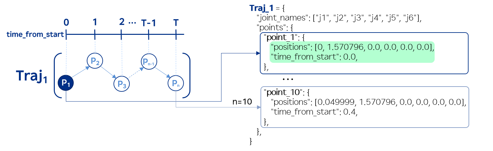
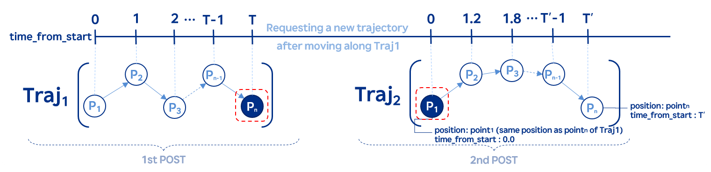
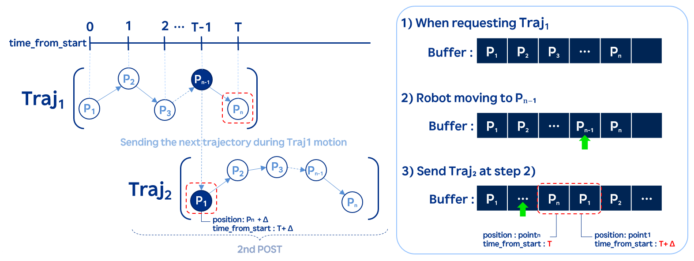

## 5.2.8 `joint_traject_insert_points`

### 설명

- 지원 버전 : `61.00-00` &uparrow;
- `POST` : 복수 개의 joint trajectory 포인트를 제어기 내부 버퍼에 저장하여 모션에 반영합니다.

---

### 주의 사항

1. **프로그램이 <u>실행 중인</u> 상태**에서만 본 API가 동작합니다.
   - ex) job 프로그램에 "wait di1" 와 같은 구문을 자동모드에서 실행한 상태로 api 요청
   - 해당 조건을 만족하지 않고 요청하는 경우, [외부지령 동작 불능상태 (E01554)](https://hr-alarms.web.app/#/hi6/ko/E01554) 에러가 발생합니다.

2. 한 번에 POST 가능한 궤적의 최대 포인트 수는 <u>**2048개**</u>입니다.
   - 궤적의 포인트를 저장하는 <u>**버퍼의 최대 크기가 2048**</u>입니다.

3. 요청된 궤적의 포인트들은 모션에 반영되기 전까지 사라지지 않으며 해당 위치로 도달할 때까지 로봇이 움직입니다.
   - [joint_traject_init](./7-joint_traject_init.md) api 로 버퍼를 강제로 초기화하지 않는 이상 모션 수행 전까지 버퍼의 궤적은 유지됩니다.

4. 궤적에 따라 [축속도 제한값 초과 (E159)](https://hr-alarms.web.app/#/hi6/ko/E159) 에러가 발생할 수 있으며, 해당 에러가 발생하면 로봇은 정지합니다.

5. 해당 API 는 <u>**2개 이상**</u>의 포인트들로 구성된 궤적에 대해서 처리합니다.

6. 부가축 사용 시, 축 좌표 값의 단위에 유의하시기 바랍니다.
---

### path-parameter

<div style="width: fit-content;">

```joint_traject_insert_points
POST /project/robot/trajectory/joint_traject_insert_points
```
</div>

### request-body

<div style="width: fit-content;">

- 	|               키 값 |       타입      | 설명                          | 비고                                           |
	| ----------------: | :-----------: | --------------------------- | -------------------------------------------- |
	|     `joint_names` | array(string) | 궤적 대상 joint 이름 리스트          | ex) 6축, `"j1"` \~ `"j6"` 형식, **순서까지 정확히 기입** |
	|          `points` |     object({})    | 실행될 trajectory 포인트 목록       | key: `"point_n"`, n은 1부터 시작, **2개 이상 필수**    |
	|       `positions` | array(double) | 각 joint의 목표 위치<br>(radian, **<u>부가축은 축좌표 단위 고려</u>**) | 현재 축 수만큼 위치를 선정하여 요청해야 함 |
	| `time_from_start` |     number    | 해당 포인트의 시작 시간 (초 단위)        | `0.0 이상`, **이전 포인트보다 커야 함**          |

</div>

- ```
	{
		"joint_names": ["j1", "j2", "j3", "j4", "j5", "j6"],
		"points": {
			"point_1": {
					"positions": [0, 1.570796, 0.0, 0.0, 0.0, 0.0],
					"time_from_start": 0.0
			},
			"point_2": {
					"positions": [0.049999, 1.570796, 0.0, 0.0, 0.0, 0.0],
					"time_from_start": 0.4
			}
		}
	}

  ```

### response-body

- 200: 요청 성공
- 403: 요청 실패
  - 서비스 되지 않는 API 에 대해서 요청을 한 경우

### error code (response 403)

<div style="width: fit-content;">

- 	| 에러코드     | 에러 상수명                   | 설명                                             |
	| ---------- | --------------------------- | ----------------------------------------------------- |
	| `-2`       | `ERR_MISSING_JOINT_NAMES`   | joint\_names 필드가 누락된 경우 |
	| `-3`       | `ERR_INVALID_JOINT_NAMES`   | joint\_name 형식이 잘못되거나("x1"), 요청한 축들의 수가 현재 로봇 축수와 일치하지 않거나, joint 이름 표기 순서 오류(["j1", "j3", "j2", ... ,"j6"]) |
	| `-4`       | `ERR_MISSING_POINTS`        | points 필드가 누락된 경우                                       |
	| `-5`       | `ERR_INVALID_POINTS`        | points 값이 객체(= python의 dict)가 아닌 경우 (예: 정수나 문자열 등) |
	| `-6`       | `ERR_TOO_FEW_POINTS`        | 궤적의 포인트 개수가 2개 미만인 경우                                |
	| `-7`       | `ERR_TOO_MANY_POINTS`       | 허용 가능한 포인트 개수 2048개를 초과하여 궤적을 요청한 경우            |
	| `-8`       | `ERR_POINTS_EXCEED_BUFFER`  | 현재 비어있는 버퍼공간보다 많은 포인트로 이루어진 궤적을 요청한 경우          |
	| `-9`      | `ERR_INVALID_POINT_OBJECT`  | point\_n 값이 객체(= python의 dict)가 아닌 경우 (예: 정수나 문자열 등)  |
	| `-10`      | `ERR_MISSING_POSITIONS`     | positions 필드가 누락된 경우                     |
	| `-11`      | `ERR_INVALID_POSITIONS`     | positions 가 배열이 아니거나, position 값이 number가 아니거나, 길이가 축 수와 일치하지 않거나 |
	| `-12`      | `ERR_MISSING_TIME`          | time\_from\_start가 누락된 경우         |
	| `-13`      | `ERR_INVALID_TIME`          | time\_from\_start가 number가 아니거나, time\_from\_start가 0보다 작거나, 움직이는 상태에서 이전 값보다 작은 값을 요청한 경우 |

</div>

### 사용 예

**예시1. 정지 상태에서 궤적 요청하기**



1) 정지 후 궤적을 요청을 할 때는 [joint_traject_init](./7-joint_traject_init.md) api를 활용하여 기존 궤적이 저장된 버퍼를 초기화합니다.
2) 궤적을 요청하기 전, 프로그램이 실행 중인지 확인하고 남아있는 버퍼의 수를 확인합니다.
3) 최소 **2개의 포인트**로 이루어진 궤적을 요청합니다.
   - 시작 포인트(point_1)의 `position` 은 **현재 로봇의 위치**로 설정합니다.
   - 시작 포인트(point_1)의 `time_from_start` 는 **0.0**으로 설정합니다.
   - 이후 포인트들은 직전 포인트에서 이동가능한 position 과 time_from_start 를 설정하여 post 합니다.
4) 에러가 발생하여 멈춘 경우, 재시작 시 joint_traject_init 으로 초기화를 진행 후 1-3의 과정을 진행합니다.

<br>

**예시2. 불연속 모션으로 궤적 요청하기 (궤적과 궤적 사이 정지 시간이 존재)**



1) 예시1 의 조건들에 맞춰 traj1 과 traj2 를 요청해야합니다.
2) 하기 사항에 유의하십시오.
   - traj2 의 P1 의 positions == traj1 의 Pn 의 positions
   - traj2 의 P1 의 time_from_start 는 0.0 이어야합니다.

<br>

**예시3. 연속 모션으로 궤적 요청하기**



1) 예시1 의 조건들에 맞춰서 traj1 을 요청합니다.
2) Pn-1 의 위치로 로봇이 이동 중일 때 하기 사항에 유의하여 traj2 를 요청해야합니다.
   - traj1 의 Pn 과 traj2 의 P1 은 로봇이 자연스럽게 연속해서 이동가능하도록 설정해야합니다.
     - traj2 의 P1 의 time_from_start 는 traj1 의 마지막 포인트 Pn 의 Δ(>0) 만큼 누적 증가된 값이어야 합니다.
     - traj2 의 P1 의 position 는 traj1 의 Pn 에서 Δ 동안 이동 가능한 위치여야 합니다.
   - 자연스럽게 이어지지 않는 궤적을 연속해서 요청하는 경우, [축속도 제한값 초과 (E159)](https://hr-alarms.web.app/#/hi6/ko/E159) 에러가 발생할 수 있습니다.

<div style="width: fit-content;">

<br>

#### Python Script 예시

- 로봇 기준자세(6축 기준, [0,90,0,0,0,0] 로 이동)
- 아래 0001.job 을 생성하여 자동모드에서 실행하여 프로그램 재생 상태로 진입합니다.
- 0001.job
	```job
	Hyundai Robot Job File; { version: 1.6, mech_type: "-1()", total_axis: -1, aux_axis: -1 }
	  > wait di1
		end
	```
- 테스트 스크립트 실행 (예시3. 두 개의 궤적을 연속 모션으로 요청하기)

	```
	조건1. traj_2 의 point_1 의 time_from_start 는 traj_1 의 point_2 에서 Δ(>0) 만큼 누적 증가된 값
	조건2. traj_2 의 point_1 의 positions 는 traj_1 의 point_2 에서 Δ 동안 이동 가능한 위치
	```

	```python
	import requests
	import time
	import math

	session = requests.Session()


	traj_2 = {
		"joint_names": ["j1", "j2", "j3", "j4", "j5", "j6"],
		"points": {
			"point_1": {
					"positions": [
						math.radians(2.89),
						math.radians(90),
						0,
						0,
						0,
						0,
					],
					"velocities": [0.0] * 6,
					"accelerations": [0.0] * 6,
					"time_from_start": 5.0,
			},
			"point_2": {
					"positions": [
						0,
						math.radians(90),
						0,
						0,
						0,
						0,
					],
					"velocities": [0.0] * 6,
					"accelerations": [0.0] * 6,
					"time_from_start": 7,
			},
		},
	}

	traj_1 = {
		"joint_names": ["j1", "j2", "j3", "j4", "j5", "j6"],
		"points": {
			"point_1": {
					"positions": [
						0,
						math.radians(90),
						0,
						0,
						0,
						0,
					],
					"velocities": [0.0] * 6,
					"accelerations": [0.0] * 6,
					"time_from_start": 0.0,
			},
			"point_2": {
					"positions": [
						math.radians(2.86),
						math.radians(90),
						0,
						0,
						0,
						0,
					],
					"velocities": [
						math.radians(5.73),
						0.0,
						0.0,
						0.0,
						0.0,
						0.0,
					],
					"accelerations": [0.0] * 6,
					"time_from_start": 3.0,
			},
		},
	}

	post_cnt = 0


	def is_prog_running(base_url: str) -> bool:
		uri = f"{base_url}/project/rgen"
		headers = {"Content-Type": "application/json; charset=utf-8"}

		try:
			ret = session.get(url=uri, headers=headers)
			return ret.json()["is_playback"]
		except Exception as e:
			print(f"Error in is_prog_running")
			return None


	def get_jt_buff_avail_num(base_url) -> int:
		uri = f"{base_url}/project/robot/trajectory/joint_traject_buf_avail"
		headers = {"Content-Type": "application/json; charset=utf-8"}

		try:
			ret = session.get(url=uri, headers=headers)
			return ret.json()["val"]
		except Exception as e:
			print(f"Error in get_jt_buff_avail_num: {e}")
			return None


	def post_trajectories(base_url: str, trajects: dict):
		global post_cnt
		uri = f"{base_url}/project/robot/trajectory/joint_traject_insert_points"
		headers = {"Content-Type": "application/json; charset=utf-8"}

		if is_prog_running(base_url) == False:
			print("Program is not running!")
			return None

		n_jt_buff_avail = get_jt_buff_avail_num(base_url)
		if n_jt_buff_avail <= 0:
			print("Current joint trajectory buffer is full.")
			return None

		try:
			start = time.time()
			ret = session.post(url=uri, headers=headers, json=trajects)
			end = time.time()
			elapsed_ms = (end - start) * 1000

			print(
					f"[{post_cnt}] elapsed_ms: {elapsed_ms:.3f} ms. available jt buff: {n_jt_buff_avail - 1}/2048"
			)
			post_cnt += 1

			print(ret, ret.json())

			ret.raise_for_status()
			return ret
		except Exception as e:
			print(f"Error in post_trajectories: {e}")
			return None


	def post_init_trajectories(base_url: str):
		uri = f"{base_url}/project/robot/trajectory/joint_traject_init"
		headers = {"Content-Type": "application/json; charset=utf-8"}

		try:
			ret = session.post(url=uri, headers=headers)
			ret.raise_for_status()
			return ret
		except Exception as e:
			print(f"Error in post_init_trajectories: {e}")
			return None


	if __name__ == "__main__":
		base_url = f"http://192.168.1.150:8888"

		while True:
			post_init_trajectories(base_url)
			ret = post_trajectories(base_url, trajectories_go)
			time.sleep(1) # 1초 후 연속적으로 궤적을 post
			ret = post_trajectories(base_url, trajectories_back)
			time.sleep(8) # 최종 time_from_start 를 고려하여 1초를 더한 8초로 설정

	```

- ```sh
		$python test.py
		[0] elapsed_ms: 6.122 ms. available jt buff: 2047/2048
		<Response [200]> {'_type': 'JObject'}
		[1] elapsed_ms: 3.997 ms. available jt buff: 2046/2048
		<Response [200]> {'_type': 'JObject'}
		...
	```


</div>